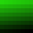
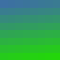
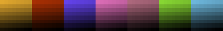
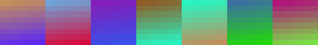
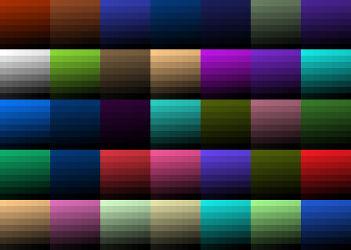

# number2image
Make image from number for Neural Networks

## Why
From my experience with neural networks, I have found that neural networks work best in the image.

I was often asked if artificial intelligence would recognize XY in an image.
The answer is that what you see is recognized by NN. 

## Install
python3 -m pip install -r requirements.txt

## Run
### One number to image (max number 16777215)
For example make image for number 7 from 49
``` python3 number_to_image.py 7 49 ```
(7 is number from range from 1 to 49)


### One number to image (max number 2.81474943156e+14)
For example make image for number 7 from 49
``` python3 number_to_image2.py 7 49 ```
(7 is number from range from 1 to 49)


### One number to image (two colors 16777215 ** 2)
For example make images start color 27 and end with color 5 in range 49
``` python3 number_to_image3.py 27 5 49 ```


###  number to image from two colors (max number 16777215)
For example make random images from range 1 to 49 seven times
``` python3 numbers_to_image.py 49 7 ```


### One number to image from two colors (max number 2.81474943156e+14)
For example make random images from range 1 to 49 seven times
``` python3 numbers_to_image2.py 49 7 ```


### Make images from csv (max number 16777215)
Csv file loto1.csv
From column 3
To column 10
``` python3 csv_to_image.py loto1.csv 3 10 49 ```
(images will be saved in the "images" directory)


### Make images from csv (max number 2.81474943156e+14)
Csv file loto1.csv
From column 3
To column 10
``` python3 csv_to_image2.py loto1.csv 3 10 49 ```
(images will be saved in the "images" directory)



